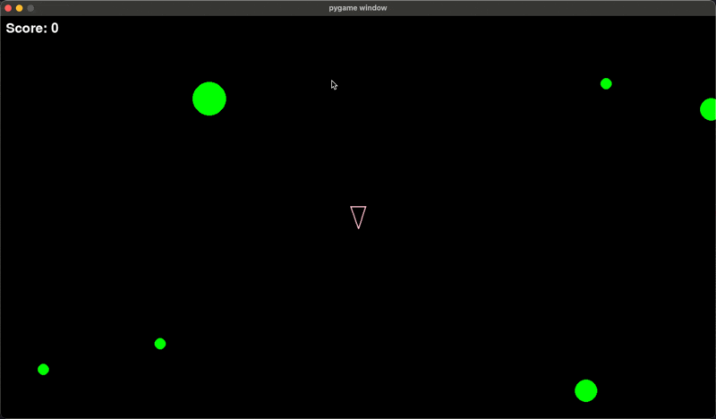

# Asteroids Game

<p align="center">
  
</p>

## Description
A classic Asteroids arcade game clone built with Python and Pygame. Control your spaceship, shoot asteroids, and survive as long as possible while racking up points.

## Features
- Smooth ship controls with rotation and thrust
- Shooting mechanics with cooldown
- Asteroid splitting system with particle effects
- Score tracking system
- Different asteroid sizes with varying point values
- Continuous asteroid spawning from screen edges

## Controls
- `W` - Move forward
- `S` - Move backward
- `A` - Rotate left
- `D` - Rotate right
- `SPACE` - Shoot

## Installation

1. Clone the repository:
```bash
git clone git@github.com:KiefBC/Asteroids-Game.git
```

2. Create and activate a virtual environment (optional but recommended):
```bash
python -m venv venv
source venv/bin/activate  # On Windows: venv\Scripts\activate
```

3. Install dependencies:
```bash
pip install -r requirements.txt
```

## Running the Game
```bash
python main.py
```

## Scoring System
- Large Asteroid: 10 points
- Medium Asteroid: 5 points
- Small Asteroid: 1 point

## Dependencies
- Python 3.x
- Pygame 2.6.1

## License
Do wut u want.